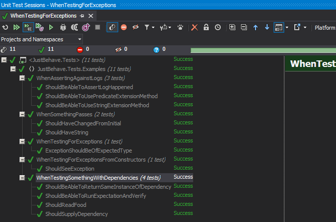

JustBehave
==========
_A BDD-influenced C# testing library cooked up by JUST EAT_

---

Appveyor: 

* Introduction
* Installation
* Getting Started
* Documentation
* Contributing
* Copyright

JustBehave is a small .NET library that helps you structure your C# tests into BDD-style contexts and scenarios.
It supports both **NUnit** and **XUnit** and depends on **AutoFixture** for automatic dependency construction using your mocking framework of choice.

JustBehave was written to ensure that our internal tests followed a consistent and sane BDD pattern, without relying on frameworks like SpecFlow and the Gherkin language. Tests written using JustBehave are structured and organised, without requiring additional tooling or plugins.
		

## Installation

Pre-requisites: The project is built in .net v4.0.

* From source: https://github.com/justeat/JustBehave
* By hand: https://www.nuget.org/packages/JustBehave

Via NuGet:

		PM> Install-Package JustBehave


## Getting Started

Once you have the package installed into your test project, along with your test framework of choice, a standard JustBehave test file will look like this using XUnit:
```csharp
	//public class TestClassNamedAfterABddContext : XBehaviourTest<TheClassThatIWantToTest> // XUnit
	public class TestClassNamedAfterABddContext : BehaviourTest<TheClassThatIWantToTest> // NUnit
	{
		private string _input;
		private string _result;

		protected override void Given()
		{
			_input = "my input";
		}

		protected override void When()
		{
			_result = SystemUnderTest.CallingAMethod(_input);
		}

		[Then]
		public void ReturnsSomething()
		{
			_result.ShouldBe("something");
		}
	}
```
A full set of tested examples are provided in the repository in the project **JustBehave.Tests** in the **Examples** namespace.
		
## Documentation 

* Important classes and attributes
* Structuring Contexts and Scenarios
* Handling and Testing Exceptions
* Testing classes with dependencies

### Important classes and attributes

The core of JustBehave is built upon a few small classes:

* `BehaviourTest` - inherited for an **NUnit** test
* `XBehaviourTest` - inherited for an **XUnit** test
* `ThenAttribute` - used to annotate your **Then** conditions for the nunit testing framework
  * when using xunit, use `FactAttribute` as normal

This leads to test classes that follow the convention:
```csharp
	public class TestClassNamedAfterABddContext : BehaviourTest<TheClassThatIWantToTest>
	{
		protected override void Given(){ /*...*/ }
		protected override void When(){ /*...*/ }
		[Then] public void Assertion1(){ /*...*/ }			
		[Then] public void Assertion2(){ /*...*/ }
	}
```
The NUnit `TestFixtureAttribute` is optional and implemented on the base of our NUnit BehaviourTest classes.

### Structuring Contexts and Scenarios

The core of JustBehave is a base class for your tests that enforces a **"Given, When, Then"** pattern. Each test file represents a single context with a *Given*, a *When*, and multiple *Then* assertions. 

Broader tests are constructed by **inheriting from previous test classes**, and overriding the *Given* or *When* steps, while adding additional *Then* conditions to construct scenarios. Expect to use namespaces to group related scenarios, while **giving your test classes names that represent their context**. 

For example, when testing some payment infrastructure, expect to end up with a set of files like this:

	/Tests/Payments/WhenIMakeAPayment.cs
	/Tests/Payments/AndMyPaymentIsRejected.cs (inherits from WhenIMakeAPayment.cs)
	/Tests/Payments/AndMyPaymentIsAccepted.cs (inherits from WhenIMakeAPayment.cs)
		
By following this style, you'll end up with a ReSharper test runner that looks like this:


		
### Handling and Testing Exceptions

If you want to assert on thrown exceptions, you setup your Given() step like this:
```csharp
	protected override void Given()
	{
	    RecordAnyExceptionsThrown();
	}
```		
Any exceptions thrown will then be available in your Then steps for you to assert on:
```csharp        
	[Then]
	public void ShouldSeeException()
	{
		ThrownException.ShouldBeTypeOf<NotSupportedException>();
	}
```	
### Testing classes with dependencies

In order for JustBehave to construct your dependency graphs, you must either:

* Manually construct your system under test
* Configure AutoFixture and a mocking framework to auto-mock your dependencies
	
To override construction of the system under test, you need to override `CreateSystemUnderTest()` and return a valid instance:

```csharp
	protected override SomethingUnderTest CreateSystemUnderTest()
	{
		return new SomethingUnderTest();
	}
```	

Alternatively, to configure AutoFixture, you should override `CustomizeAutoFixture()` providing a valid `AutoFixture` customisation:

```csharp
	protected override void CustomizeAutoFixture(Fixture fixture)
	{
		fixture.Customize(new AutoRhinoMockCustomization());
		// You can add more customisations by adding the NuGet packages for
		// Ploeh.AutoFixture.Auto**PopularMockingFramework** and hooking them up
	}
```

## Contributing

If you find a bug, have a feature request or even want to contribute an enhancement or fix, please follow the contributing guidelines included in the repository.


## Copyright

Copyright 2011-2014 Just Eat, Inc. or its affiliates. All Rights Reserved.

Licensed under the Apache License, Version 2.0 (the "License"). You
may not use this file except in compliance with the License. A copy of
the License is located in the LICENSE file in this repository. 

This file is distributed on an "AS IS" BASIS, WITHOUT WARRANTIES OR 
CONDITIONS OF ANY KIND, either express or implied. See the License 
for the specific language governing permissions and limitations under 
the License.
